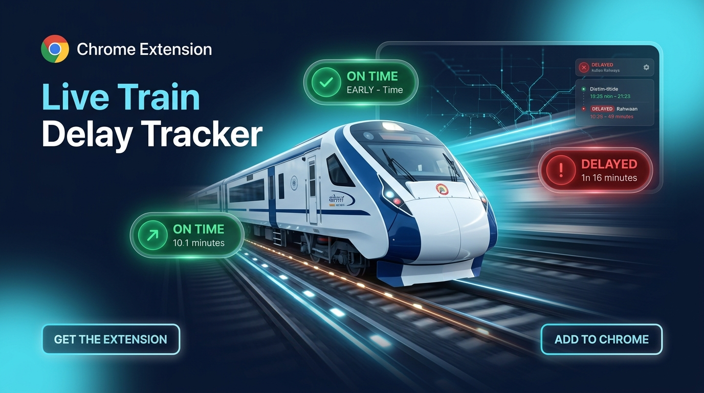

# 🚆 Live Train Delay Tracker (v2.0.0)



<p align="center">
  
  <br />
  <strong>Open-source, high-performance Chrome & Chromium Extension displaying real-time train running delays and historical punctuality directly on ConfirmTkt, MakeMyTrip, ClearTrip, Ixigo, Goibibo, and Paytm.</strong>
</p>

<p align="center">
  <a href="https://github.com/RajdipGhosh99/irctc-live-delay-extension/blob/main/LICENSE"></a>
  <a href="https://github.com/RajdipGhosh99/irctc-live-delay-extension/releases/tag/v2.0.0"></a>
  <a href="https://github.com/RajdipGhosh99"></a>
  
  
  
</p>

---

## 🌟 Key Features

- ⚡ **Zero-Friction Live Delay Badges:** Injects interactive `[🚆 Check ↻]` badges directly beside train names on search results pages.
- 📊 **3-Metric Delay Analytics:**
  - **`🟢 Today Live`** ➔ Real-time running delay for today's active trip.
  - **`📊 Today Avg`** ➔ Historical average delay on this specific day of the week across the **Last 4 Weeks**.
  - **`📈 30-Day Avg`** ➔ Overall 30-day all-days punctuality rate and percentage.
- 📍 **Crisp Live Station Position:** Short, actionable updates (e.g. `📍 Arrived at NEW DELHI (06:30)` or `📍 Departed from KOTA JN (22:28)`).
- 🚆 **Multi-Portal Modular Support:** Works out-of-the-box via isolated website adapters on:
  - ✅ **ConfirmTkt** (`confirmtkt.com`)
  - ✅ **MakeMyTrip** (`makemytrip.com`)
  - ✅ **ClearTrip** (`cleartrip.com`)
  - ✅ **Ixigo** (`ixigo.com`)
  - ✅ **Goibibo** (`goibibo.com`)
  - ✅ **Paytm Travel** (`paytm.com`)
  - ✅ **EaseMyTrip** (`easemytrip.com`)
  - ✅ **RailYatri** (`railyatri.in`)
  - ✅ **Generic Leaf Scanner** (Fallback for any upcoming booking portal)
- 🛡️ **Multi-Token API Rotation Pool:** Automatically rotates across direct public gateway, RapidAPI Rail Engine 1, RapidAPI Rail Engine 2, and IndianRailAPI with automatic circuit breaker fallback.
- 💾 **Smart Local Cache:** 0 duplicate API calls on hover — cached entries load instantaneously with 15-minute TTL and zero network overhead.
- 🎛️ **Floating HUD with Batch Fetch:** Floating controller pinned to the viewport with `⚡ Fetch All` and tab-specific dismissal.
- 🔍 **Instant Quick Search Popup:** Look up any 5-digit train number directly from the browser extension popup without visiting any booking website.

---

## 🏛️ Modular Strategy Pattern Architecture

```
                                  [ User Browses Booking Site ]
                                                │
                                  [ PortalRegistry.getActiveAdapter() ]
                                                │
         ┌──────────────────────────────┬───────┴──────────────────────┬──────────────────────────────┐
         ▼                              ▼                              ▼                              ▼
[ ConfirmTktAdapter ]          [ MakeMyTripAdapter ]          [ ClearTripAdapter ]          [ GenericPortalAdapter ]
 • Tailwind Flex Row            • React Card Layout            • Row Layout                   • Leaf Text Scanner
 • id^="train-" Selector        • .train-name-wrap             • Beside-name anchor           • Universal 5-Digit Regex
         │                              │                              │                              │
         └──────────────────────────────┴───────┬──────────────────────┴──────────────────────────────┘
                                                ▼
                                    [ Injected Delay Badge ]
                                                │
                             [ Background Service Worker Gateway ]
                                                │
                         ┌──────────────────────┴──────────────────────┐
                         ▼                                             ▼
             [ 15-Min Local Cache ]                        [ Multi-Tier Gateway Coordinator ]
              • 0 network calls                             1. Direct Public Gateway (Free)
              • Instant render                              2. RapidAPI Rail Engine 1 (Multi-Token)
                                                            3. RapidAPI Rail Engine 2 (Multi-Token)
                                                            4. IndianRail Gateway (Direct Key)
                                                            5. Custom Webhook Gateway
```

---

## 🚀 Quickstart & Developer Setup

### Prerequisites
- Node.js (v18 or higher)
- npm (v9 or higher)
- Google Chrome, Microsoft Edge, Brave, or Arc

### 1. Clone & Install
```bash
git clone https://github.com/RajdipGhosh99/irctc-live-delay-extension.git
cd irctc-live-delay-extension
npm install
```

### 2. Build the Extension
```bash
# Development build
npm run dev

# Production build
npm run build

# Package distribution zip
npm run package
```

### 3. Load in Browser
1. Open your browser and navigate to `chrome://extensions/` (or `edge://extensions/`).
2. Enable **Developer mode** in the top-right corner.
3. Click **Load unpacked** and select the `dist/` directory.
4. Open any train booking site (e.g. [ConfirmTkt](https://www.confirmtkt.com)) and start tracking!

---

## ⚙️ Configuration & Custom API Keys

1. Right-click the extension icon in your browser and select **Options** (or click the ⚙️ icon in the popup).
2. Add your personal RapidAPI or IndianRailAPI tokens for custom failover pools.
3. Toggle individual portal integrations or customize badge placement (`Beside Name`, `Below Name`, `Card Header Right`).

---

## 🔒 Privacy Policy

**Last Updated:** August 29, 2026

Live Train Delay Tracker is committed to protecting your privacy:
- **Zero Personal Data Collection:** The extension does not collect, track, transmit, sell, or share any personal data, browsing history, cookies, or user credentials.
- **Local Storage Usage:** The `storage` and `unlimitedStorage` permissions are used strictly on your local machine to cache live train status (with 15-minute TTL) and save your custom preferences.
- **Permissions:** The `tabs` and `scripting` permissions and host access patterns are used exclusively to inject interactive delay badges into train search results.
- **Zero Remote Code:** No remote scripts, `eval()`, or external executable code are used. All assets are self-contained.

---

## 📄 License & Copyleft Protection

Distributed under the **GNU General Public License v3.0 (GPL-3.0)** (Strict Copyleft / Share-Alike).

> ⚖️ **Open Source Protection Clause:**  
> This project is 100% free and open-source. Under the terms of the GNU GPLv3, anyone who modifies, extends, forks, or builds derivative software based on this codebase **must also release their derivative work as 100% open-source under the exact same GPL-3.0 license**. Proprietary derivatives, closing the source code, or commercial lock-in are legally prohibited.

See the [`LICENSE`](LICENSE) file for complete legal terms.

---

## 👨‍💻 Author & Maintainer

**Rajdip Ghosh**  
🔗 GitHub: [@RajdipGhosh99](https://github.com/RajdipGhosh99)  
🌐 Repository: [https://github.com/RajdipGhosh99/irctc-live-delay-extension](https://github.com/RajdipGhosh99/irctc-live-delay-extension)
