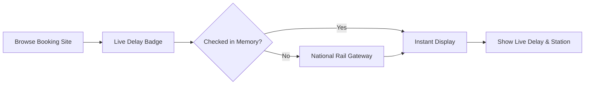

# 🚆 Live Train Delay Tracker

<p align="center">
  
  <br />
  <strong>Real-time Indian Railways live train running status and historical punctuality ratings directly on your favorite booking websites.</strong>
</p>

<p align="center">
  <a href="https://microsoftedge.microsoft.com/addons/detail/live-train-delay-tracker/pknpnmpklieceipblhgfniafbcmpakao"></a>
  <a href="https://github.com/RajdipGhosh99/irctc-live-delay-extension/releases/latest"></a>
  <a href="https://github.com/RajdipGhosh99/irctc-live-delay-extension/blob/main/LICENSE"></a>
  
</p>

---

## ⚡ Quick Install

### Option 1: Microsoft Edge Add-ons Store (Recommended)
Install with one click on **Microsoft Edge** or any Chromium browser:  
👉 **[Add to Edge from Microsoft Edge Add-ons](https://microsoftedge.microsoft.com/addons/detail/live-train-delay-tracker/pknpnmpklieceipblhgfniafbcmpakao)**

### Option 2: Chrome / Brave / Vivaldi / Opera (Manual Sideload)
1. **Download:** Grab the latest [`train-delay-tracker-v2.0.0.zip`](https://github.com/RajdipGhosh99/irctc-live-delay-extension/releases/latest/download/train-delay-tracker-v2.0.0.zip).
2. **Unzip:** Extract the archive into a permanent folder on your computer.
3. **Load:** Open `chrome://extensions/` (or `edge://extensions/`), enable **Developer mode** (top-right), click **Load unpacked**, and select the extracted folder.

---

## ✨ Features

- 🟢 **Live Delay Badges:** Interactive `[🚆 Check Live]` delay badges placed seamlessly beside train names on booking portals.
- 📊 **3-Metric Delay Analytics:**
  - **Today Live:** Current real-time delay status and live station arrival/departure.
  - **4-Week Typical:** Historical average delay for today's day of the week over the last month.
  - **Punctuality Score:** 30-day reliability rating percentage.
- 🎯 **Instant Train Lookup:** Enter any 5-digit train number in the extension popup to check its live status instantly without opening a booking site.
- 🎛️ **Floating Quick-Action Button:** Convenient button on search results to fetch all train delays on the page in a single click.
- 💾 **Data Saver & Strict 50 MB Cache:** On-demand fetching only. Remembers checked trains to save mobile data and battery with zero background tracking.
- 🇮🇳 **Out-of-the-Box National Rail Gateways:** Connects directly to real-time train feeds with zero setup, plus optional backup API key support for power users.

---

## 🌐 Supported Booking Websites

| Booking Portal | Website | Integration |
| :--- | :--- | :---: |
| **ConfirmTkt** | `confirmtkt.com` | ✅ Full Support |
| **MakeMyTrip** | `makemytrip.com` | ✅ Full Support |
| **ClearTrip** | `cleartrip.com` | ✅ Full Support |
| **Ixigo** | `ixigo.com` | ✅ Full Support |
| **Goibibo** | `goibibo.com` | ✅ Full Support |
| **Paytm Travel** | `paytm.com` | ✅ Full Support |
| **EaseMyTrip** | `easemytrip.com` | ✅ Full Support |
| **RailYatri** | `railyatri.in` | ✅ Full Support |
| **Universal Scanner** | *Any railway portal* | ✅ Auto-Detect |

---

## 🛠️ How It Works



1. When you search for tickets on any supported booking site, the extension automatically identifies train listings.
2. Click **Check Live** (or use **Fetch All Delays**) to retrieve the current running delay and station location.
3. Live results are displayed directly on the train card so you can pick the most punctual train before booking.

---

## ⚙️ Customization & Settings

Open **Settings** by clicking the gear icon ⚙️ in the extension popup or via browser extensions menu:
- **Badge Placement:** Choose whether badges appear beside the train name, below it, or in the top-right corner.
- **Data Saver Memory:** Customize how long checked trains are remembered (`0`, `1`, `5`, or `15` minutes).
- **Backup Data Sources:** Add optional RapidAPI or IndianRailAPI backup keys for automatic failover.
- **Site Controls:** Enable or pause badges for specific booking sites.

---

## 💻 Development

### Prerequisites
- Node.js (v18+)
- npm (v9+)

### Getting Started
```bash
# Clone the repository
git clone https://github.com/RajdipGhosh99/irctc-live-delay-extension.git
cd irctc-live-delay-extension

# Install dependencies
npm install

# Start development server
npm run dev

# Run type checks and build
npm run build

# Package extension zip
npm run package
```

---

## 🔒 Privacy & Terms

- **100% Local & Private:** No personal data, browsing history, cookies, or account credentials are collected or transmitted.
- **Zero Telemetry:** No analytics, trackers, or remote code execution.
- **Community Tool:** Designed for interactive passenger use to help travelers choose punctual trains.

> [!NOTE]  
> This is an independent open-source project and is not affiliated with or endorsed by Indian Railways or any third-party booking portals. Delays are informational public estimates. Always verify official station display indicators before boarding.

---

## 📄 License

This project is licensed under the **GNU General Public License v3.0 (GPL-3.0)**.  
See the [LICENSE](LICENSE) file for details.

---

## 👤 Author

**Rajdip Ghosh**  
- GitHub: [@RajdipGhosh99](https://github.com/RajdipGhosh99)  
- Microsoft Edge Add-on: [Live Train Delay Tracker](https://microsoftedge.microsoft.com/addons/detail/live-train-delay-tracker/pknpnmpklieceipblhgfniafbcmpakao)
